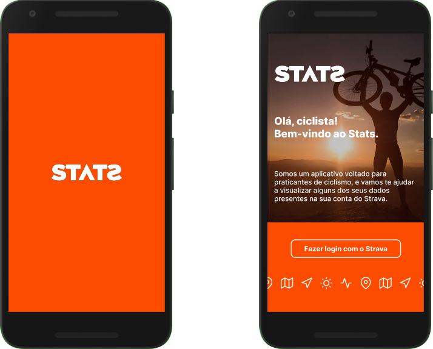
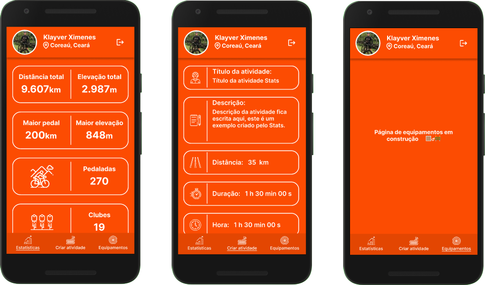

<div align="center">
  
</div>

## Stats mobile

[](https://github.com/klayverxd)
[](#)
[](https://reactjs.org)
[](https://vercel.com/)

<h4 align="center">
  Stats é uma aplicação para a visualização de dados de usuários do Strava. 🚵🏽‍♂️
</h4>

<div align="center">
  
</div>

## 📱 Páginas internas
<div align="center">
  
</div>

## 🧪 Tecnologias
<div align="center">
  <br />
  
</div>

**Este projeto foi desenvolvido usando as seguintes tecnologias:**

- [React Native](https://reactnative.dev)
- [Expo](https://expo.dev)
- [React Navigation](https://reactnavigation.org)

**Dependencias:**
```
├── navegação
│   ├── @react-navigation/native
│   └── @react-navigation/bottom-tabs
├── storage
│   └── @react-native-async-storage/async-storage
├── select e radio buttons
│   ├── @react-native-picker/picker
│   └── react-native-radio-buttons-group
├── svg images
│   ├── react-native-svg
│   └── react-native-svg-transformer
```

## 👨🏽‍💻 Inicialização com Expo

**No terminal, clone o projeto e acesse a pasta da aplicação**

```bash
$ git clone https://github.com/klayverxd/stats-mobile.git && cd stats-mobile
$ expo start
```

## 🚴🏽‍♂️ API de referência - Strava

[Strava API](https://developers.strava.com/docs/reference/)

[](https://insomnia.rest/run/?label=Strava%20API&uri=https%3A%2F%2Fraw.githubusercontent.com%2FKlayverx%2Fstats%2Fmaster%2Fstrava-api.json)

## 🔖 Layout

Você pode ver o layout do projeto no Figma no link abaixo:

- [Layout Stats](https://www.figma.com/file/6N8Nvz5j3lWwAnEXITIZw6/STATS?node-id=0%3A1) 

Lembrando que você precisa ter uma conta no [Figma](http://figma.com/) para poder acessar.

## 📝 Licença

[MIT](https://choosealicense.com/licenses/mit/)
